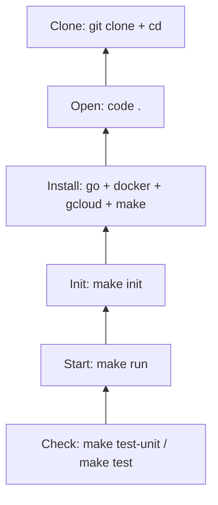
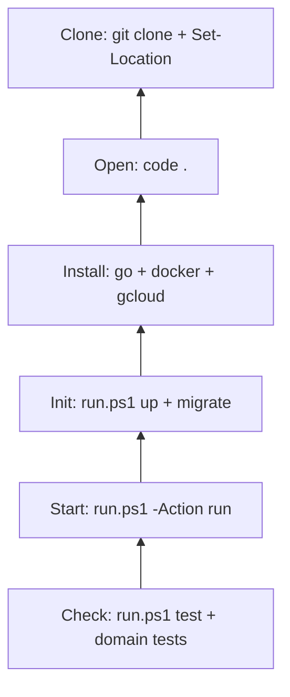

# Product Catalog Service

A Go microservice implementing a Product Catalog with DDD, Clean Architecture, CQRS, and transactional outbox pattern. Built on Google Cloud Spanner with gRPC transport.

## Architecture

```
cmd/server/          -> Entry point
internal/
  app/product/
    domain/          -> Pure business logic (aggregates, value objects, events)
    usecases/        -> Command handlers (write operations)
    queries/         -> Query handlers (read operations)
    contracts/       -> Repository & read model interfaces
    repo/            -> Spanner implementations
  models/            -> Database model structs & field constants
  transport/grpc/    -> gRPC handlers, mappers, error mapping
  services/          -> DI container
  pkg/               -> Shared utilities (clock, committer)
proto/               -> Protocol Buffer definitions
migrations/          -> Spanner DDL
```

### Design Decisions

**Domain Purity**: The domain layer has zero external dependencies - no `context.Context`, no database imports, no proto types. All business logic is expressed as pure Go.

**Golden Mutation Pattern**: Every write operation follows: Load aggregate -> Execute domain logic -> Build CommitPlan -> Apply atomically. Repositories return `*spanner.Mutation` but never apply them. The use case interactor owns the transaction boundary.

**CQRS**: Commands go through domain aggregates for validation and event capture. Queries bypass the domain, reading directly from the database via a read model interface with DTOs.

**Change Tracking**: The `ChangeTracker` on each aggregate tracks dirty fields, enabling targeted `UPDATE` mutations that only touch modified columns.

**Transactional Outbox**: Domain events are captured as intent structs during business operations. The use case enriches and serializes them into the `outbox_events` table within the same atomic transaction as the aggregate mutation.

**Money as `*big.Rat`**: All monetary values use `math/big.Rat` (stored as numerator/denominator pairs) for lossless decimal arithmetic.

### Trade-offs

- **Proto and gRPC bindings are generated** - Go bindings are generated from `proto/product/v1/product_service.proto`. Use `make proto` (powered by `buf`) to regenerate after proto changes.
- **Custom CommitPlan instead of `github.com/Vektor-AI/commitplan`** - The `commitplan` module is internal to the organization and not publicly available.  The internal `pkg/committer` package follows the same pattern: `NewPlan()` -> `plan.Add(mutation)` -> `committer.Apply(ctx, plan)`, providing identical semantics with Spanner's `Apply` for atomic transactions.
- The outbox processor is not implemented - events are stored but not dispatched. This is by design per the spec.
- No authentication, metrics, or REST gateway.

## Setup and Run

### Requirements

- Go 1.21+
- Docker (Spanner emulator)
- Google Cloud CLI (`gcloud`)
- Make (for Make workflow)

Install references:
- Go: https://go.dev/dl/
- Docker: https://www.docker.com/products/docker-desktop/
- gcloud: https://cloud.google.com/sdk/docs/install

## Workflow 1: Make (first)

Follow this exact order: clone, open project, install requirements, init, start, check.

### 1) Clone

```bash
git clone https://github.com/02goranstanojevic/Product-Catalog-Service-V1.git
cd Product-Catalog-Service-V1
```

### 2) Open project

```bash
code .
```

### 3) Install requirements

Ensure `go`, `docker`, `gcloud`, and `make` are available in your PATH.

### 4) Initialize

```bash
make init
```

What `make init` does:
- starts Spanner emulator (`make emulator-up`)
- runs database migration (`make migrate`)

### 5) Start service

```bash
make run
```

### 6) Check

```bash
make test-unit
make test
```

Pyramid diagram (Make flow):



## Workflow 2: PowerShell

Use this flow on Windows when you prefer script-based commands.

### 1) Clone

```powershell
git clone https://github.com/02goranstanojevic/Product-Catalog-Service-V1.git
Set-Location Product-Catalog-Service-V1
```

### 2) Open project

```powershell
code .
```

### 3) Install requirements

Ensure `go`, `docker`, and `gcloud` are available in your PATH.

### 4) Initialize

```powershell
.\scripts\run.ps1 -Action up
.\scripts\run.ps1 -Action migrate
```

### 5) Start service

```powershell
.\scripts\run.ps1 -Action run
```

### 6) Check

```powershell
.\scripts\run.ps1 -Action test
go test ./internal/app/product/domain/... -v -count=1
```

Pyramid diagram (PowerShell flow):



### Stop local infrastructure

Make:

```bash
make emulator-down
```

PowerShell:

```powershell
.\scripts\run.ps1 -Action down
```

## Environment Variables

| Variable | Default | Description |
|---|---|---|
| `PORT` | `50051` | gRPC server port |
| `SPANNER_DATABASE` | `projects/test-project/instances/test-instance/databases/test-db` | Spanner database path |
| `SPANNER_EMULATOR_HOST` | - | Set to `localhost:9010` for local development |

## API

The service exposes a gRPC `ProductService` with:

**Commands**: `CreateProduct`, `UpdateProduct`, `ActivateProduct`, `DeactivateProduct`, `ArchiveProduct`, `ApplyDiscount`, `RemoveDiscount`

**Queries**: `GetProduct`, `ListProducts` (with category filter and pagination)

See [proto/product/v1/product_service.proto](proto/product/v1/product_service.proto) for the full API definition.

## Testing

**Unit tests** cover domain logic in isolation - product state machine, money arithmetic, discount validation, pricing calculations.

**E2E tests** run against the Spanner emulator, exercising the full flow from use case interactors through repositories to the database and back through queries.

### Test modes (local)

- Unit only (no Docker required):

PowerShell (Windows):

```powershell
go test ./internal/app/product/domain/... -v -count=1
```

Makefile:

```bash
make test-unit
```

- E2E only (requires emulator):

```bash
SPANNER_EMULATOR_HOST=localhost:9010 go test ./tests/e2e -v -count=1
```

- All backend tests:

PowerShell (Windows):

```powershell
.\scripts\run.ps1 -Action test
```

Makefile:

```bash
make test
```

On Windows PowerShell for E2E:

```powershell
$env:SPANNER_EMULATOR_HOST='localhost:9010'; go test ./tests/e2e -v -count=1
```

### Important note

- This repository is backend-only (no frontend is included by design).
- Main readiness goal is: build succeeds, migrations apply, tests pass, and gRPC server starts successfully.

```bash
# Unit tests only
make test-unit

# All tests (requires emulator)
make test
```
